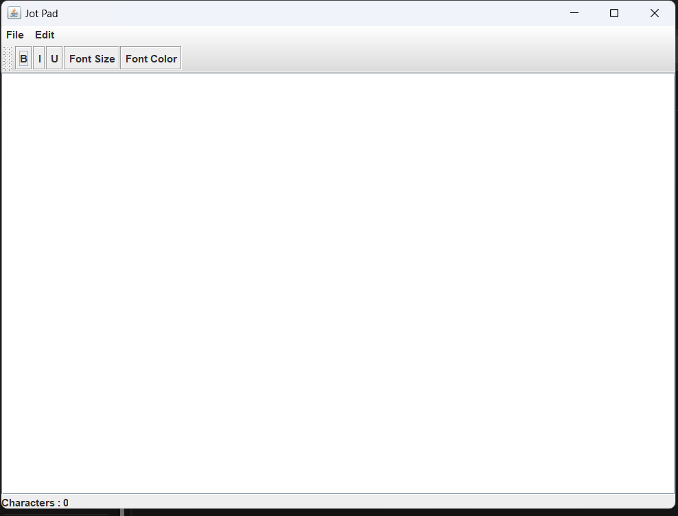

# Jot Pad
This is a Java Swing GUI Rich Text Editor with more than 5 formatting option various file and edit option. I call it the ultimate note pad.


## Installation

If you have Java JDK in your computer you can download the .jar file named  
```bash
  ./JotPad.jar
```
If you do not have Java JDK in your computer you can download the .exe file named
```bash
  ./jotpadv1.exe
```
    
## Demo



